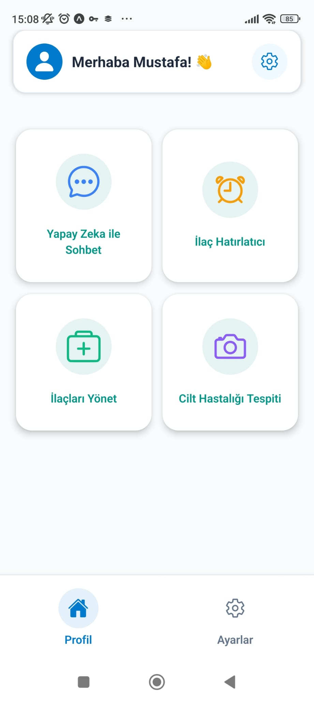
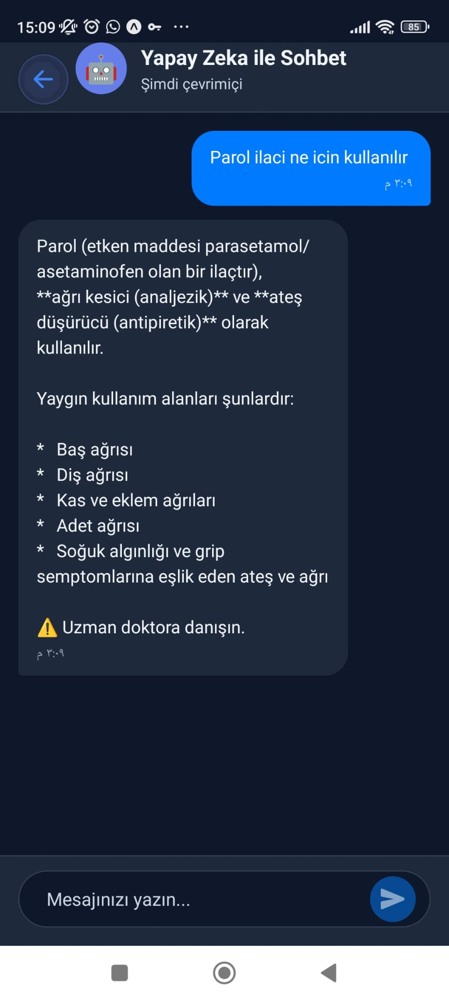
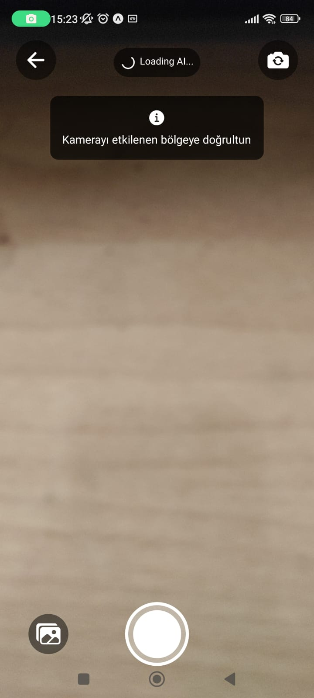
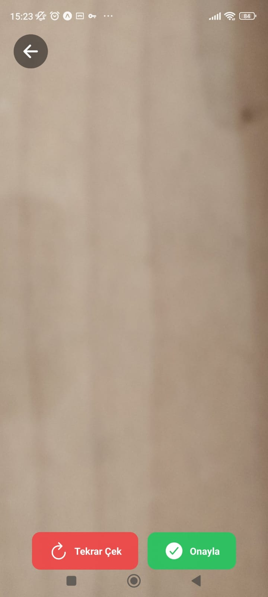
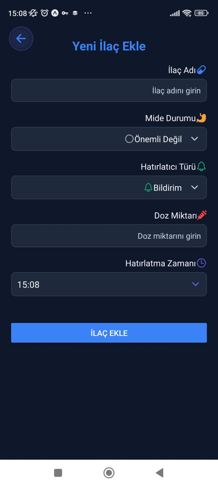
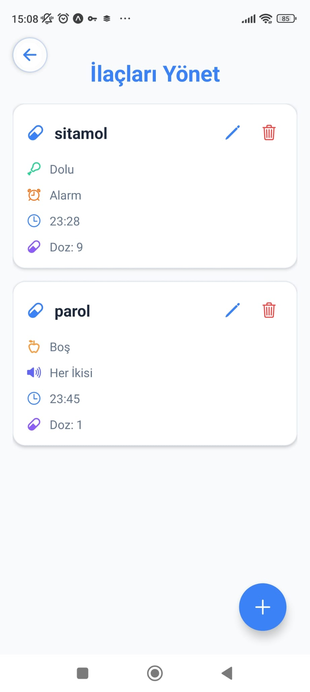
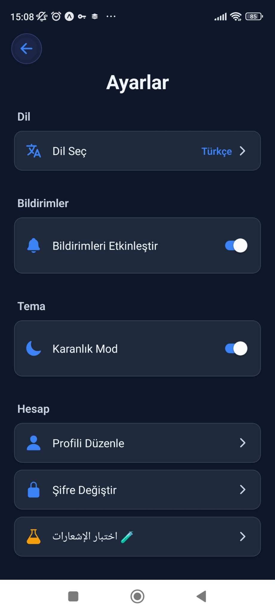

# 🏥 Smart Health Assistant | مساعد الصحة الذكي
### AI-Powered Multilingual Mobile Health Application
### تطبيق صحي ذكي متعدد اللغات للهواتف المحمولة

Smart Health Assistant is an **AI-powered, multilingual mobile health application** built with **React Native and Expo**. The app helps users manage medications, interact with an AI health assistant, and perform **preliminary skin condition analysis** using on-device machine learning (TensorFlow.js) with cloud-based Google Gemini fallback reports.

مساعد الصحة الذكي هو تطبيق صحي للهواتف المحمولة متعدد اللغات يعمل بالذكاء الاصطناعي، تم بناؤه باستخدام **React Native** و **Expo**. يساعد التطبيق المستخدمين على إدارة الأدوية، والتفاعل مع مساعد صحي بالذكاء الاصطناعي، وإجراء **تحليل أولي للأمراض الجلدية** باستخدام التعلم الآلي المحلي على الهاتف (TensorFlow.js) مع تقارير داعمة سحابية مدعومة بنموذج Google Gemini.

---

## 🎯 Project Motivation | دوافع المشروع

Managing daily health tasks such as medication schedules, early symptom awareness, and accessing basic health guidance can be challenging.

This project aims to:
- Simplify **personal health management** for diverse users.
- Demonstrate **real-world on-device AI integration** in mobile apps.
- Provide a clean, scalable, and multilingual mobile architecture supporting LTR/RTL layouts.

> ⚠️ **Disclaimer / إخلاء مسؤولية:** This application is **not a medical product** and is intended for **educational, demonstration, and preliminary awareness purposes only**. Always consult a professional doctor for medical advice.
> 
> هذا التطبيق **ليس منتجاً طبياً** ومخصص **لأغراض التعليم والتوضيح والتوعية الأولية فقط**. استشر دائماً طبيباً مختصاً للحصول على استشارة طبية.

---

## ✨ Key Features | الميزات الرئيسية

### 🤖 AI Health Chat | الدردشة الصحية بالذكاء الاصطناعي
- AI-powered chat using **Google Gemini AI** (`gemini-2.5-flash`).
- Natural language health-related explanations.
- Responses automatically adapted to the selected language (Arabic, English, Turkish).

### 💊 Medication Management | إدارة الأدوية والتذكيرات
- Add, edit, and delete medications.
- Schedule automatic notification reminders.
- Dosage instructions based on meal times (empty stomach / full stomach).
- Local notifications scheduled dynamically via **Expo Notifications**.

### 📸 Skin Disease Detection (Local AI) | تشخيص الأمراض الجلدية (ذكاء اصطناعي محلي)
- Capture images via camera or import from the gallery.
- Real-time, **on-device** image analysis using a local **TensorFlow.js model** (stored under `assets/model/`).
- Classifies common skin conditions (Acne, Eczema, Rosacea, Carcinoma, Keratosis, Milia).
- Generates a detailed AI report locally without uploading photos to external servers.

### 🔐 Authentication & User Management | الحسابات والمصادقة الأمنية
- Secure login, registration, and password recovery using **Firebase Authentication**.
- Profile information management and secure password updates.

### 🌍 Multilingual & RTL Support | دعم كامل للغات والاتجاهات
- Complete localization for **Arabic (RTL)**, **English**, and **Turkish** using `i18next`.
- Smooth user interface adjustments according to language direction.

---

## 🚀 Getting Started | دليل البدء والتشغيل

Follow these steps to run the project locally or build the APK file.

### Prerequisites | المتطلبات الأساسية
- **Node.js** (v18 or higher recommended)
- **Expo CLI** (`npm install -g expo-cli`)
- **EAS CLI** (for cloud builds: `npm install -g eas-cli`)

---

### 💻 Local Installation | التثبيت المحلي

1. **Clone the repository | استنساخ المستودع**
   ```bash
   git clone https://github.com/YOUR_USERNAME/smart-health-assistant.git
   cd smart-health-assistant
   ```

2. **Configure Environment Variables | إعداد ملف البيئة**
   Copy the example environment file and rename it to `.env`:
   ```bash
   cp .env.example .env
   ```
   Open the `.env` file and replace the placeholder with your actual Google Gemini API key:
   ```env
   EXPO_PUBLIC_GEMINI_API_KEY=your_google_gemini_api_key_here
   ```

3. **Install Dependencies | تثبيت المكتبات**
   Install the node packages using the legacy peer dependencies setting:
   ```bash
   npm install
   ```

4. **Configure Firebase | إعداد قاعدة البيانات**
   Update the Firebase config inside `firebase.tsx` with your web app credentials from the Firebase Console.

5. **Start Development Server | تشغيل خادم التطوير**
   ```bash
   npm run start
   ```
   Scan the QR code in your terminal using the Expo Go app on your phone (or press `a` for Android Emulator / `i` for iOS Simulator).

---

### 📦 Building the Android APK | بناء تطبيق الأندرويد

To build a standalone APK without publishing to the app stores, use Expo Application Services (EAS):

1. **Log in to Expo | تسجيل الدخول في إكسبو**
   ```bash
   npx eas-cli login
   ```

2. **Run EAS Build | بدء بناء الملف**
   ```bash
   npx eas-cli build --platform android --profile preview
   ```
   This will compile the app on the Expo cloud servers and provide a direct download link for the `.apk` file once finished.

---

## 🧠 Model Details & Training | تفاصيل تدريب النموذج

The **Skin Disease Classifier** is built using TensorFlow/Keras and converted for mobile devices.

### Preprocessing & Architecture
- **Input Size:** 224x224 RGB images.
- **Augmentation:** Rotation, zoom, horizontal flips, and brightness variation to prevent overfitting.
- **Deployment:** Converted to TensorFlow.js Graph Model layers. Shards and `model.json` are stored in `assets/model/` and parsed locally during classification.

---

## 📸 Screenshots | لقطات من التطبيق

### Home Screen


### AI Chat & Skin Diagnosis
<p float="left">
  
  
  
</p>

### Medication Scheduler
<p float="left">
  
  
</p>

### Auth & Settings
<p float="left">
  
  
</p>

---

## 🛠️ Tech Stack | التقنيات المستخدمة

- **Frontend:** React Native, Expo SDK 54, TypeScript, React Navigation, React Hook Form, i18next (Localization).
- **Database & Auth:** Firebase Authentication, Firestore Database.
- **AI Engine:** Google Gemini API, TensorFlow.js React Native wrapper.
- **Build System:** EAS (Expo Application Services).
